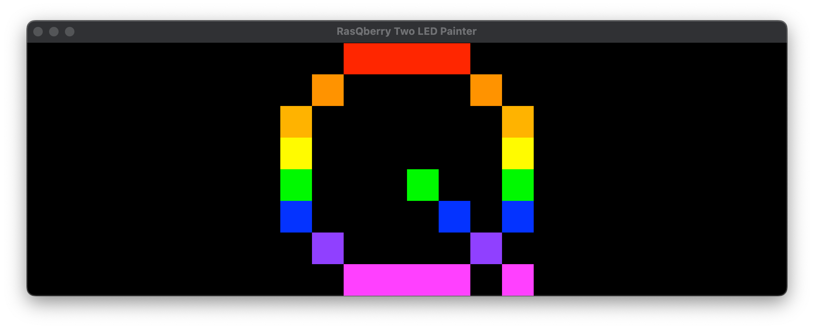

# RasQberry-Two-LED-Painter



This is a program for the RasQberry Two Project, designed to paint an image to be displayed on the LED array.

The git repo for the RasQberry Two Project can be found [here](https://github.com/JanLahmann/RasQberry-Two).

## Installation

Install all the necessary dependencies using pip:

```python
pip install -r requirements.txt
```

You will also need to install the `libxcb` library using the following command:

```sh
sudo apt install libxcb-cursor-dev
```

## How to Run

Run the script using:

```python
python3 LED_painter.py
```

### Saving and Importing images

You can save your images to a JSON file by going to `File -> Save` in the toolbar. These images can be re-imported later by going to `File -> Import`.

You can clear the current canvas by going to `File -> Clear`, take note that this will also clear any image currently displayed on the LEDs.

### Displaying an image through the command line

To display a saved image through the command line, run the following command and paste the path of the saved image file (in json format) into the console:

```python
python3 display_to_LEDs_from_file.py
```

Or, you can provide the path to the image file (in json format) by using the '-f' argument:

```python
python3 display_to_LEDs_from_file.py -f path_to_file.json
```

### Turning off the LEDs

To turn off all of the LEDs, simply close the program window. Alternatively, you can run this script:

```python
python3 turn_off_LEDs.py
```

**! Note:** To run this script on a Raspberry Pi 5, you need to have SPI set up and use the proper wiring configuration. Instructions for wiring and setting up SPI can be found [here](https://rasqberry.org/3d-model/hardware-assembly-guide).
